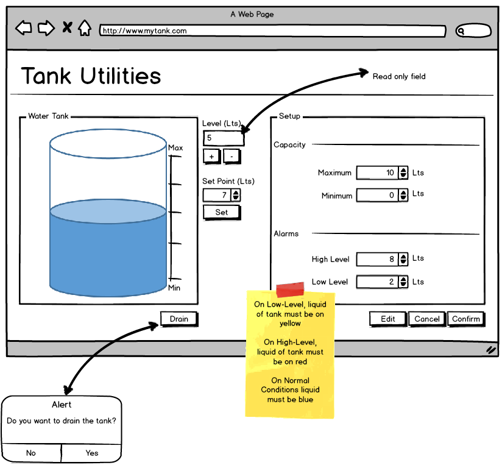

### Control del nivel de un tanque

#### Descripción

Desarrollar una interfaz de un usuario que permita monitorear y controlar el nivel de líquido 
contenido en un tanque. El sistema debe cumplir con los siguientes requerimientos:

| Req. | Nombre | Descripción |

A. Control manual de nivel : Permitir al usuario aumentar o disminuir el nivel de líquido en 
el tanque de manera manual

B. Control automático del nivel : El usuario ingresa un valor de nivel deseado (Set Point) y 
el sistema automáticamente aumenta o disminuye la cantidad de líquido en el tanque para 
alcanzar el valor deseado

C. Configurar capacidad del tanque : Permitir al usuario editar el valor mínimo y máximo de la
 capacidad del tanque

D. Vaciar tanque : Permitir al usuario vaciar el líquido del tanque en cualquier momento. El 
sistema debe solicitar confirmación del usuario para continuar

E. Generar Alarmas : El sistema generará una alarma por bajo nivel de líquido en el tanque o 
por alto nivel de líquido.  Cuando el nivel del tanque sea alto, el líquido debe mostrarse en
color rojo. Cuando el nivel del líquido sea bajo, el líquido debe mostrarse en amarillo. 
En condiciones normales el líquido debe estar en color azul

F. Configurar Alarmas : El usuario tiene la capacidad de configurar los niveles de líquido 
necesarios para generar alarma por alto o bajo nivel

G. Animaciones : La interfaz debe simular el proceso de llenado o vaciado del tanque

H. Validaciones : El sistema debe realizar las siguientes validaciones:
El sistema debe realizar las siguientes validaciones:
- Los valores que ingrese el usuario deben estar dentro de las capacidades (min/max) del tanque
- Validar el ingreso de texto en campos numéricos
- Deshabilitar las funciones de control de nivel cuando el usuario este configurando la 
capacidad del tanque o las alarmas de nivel

#### Interfaz

La siguiente imagen describe como debería lucir la interfaz de usuario, no obstante, el 
desarrollador es libre de proponer un nuevo diseño siempre y cuando cumpla con los 
requerimientos expuestos anteriormente.

##### Requerimientos

La interfaz debe desarrollarse utilizando las siguientes tecnologías:

- Visual Studio 2013+
- ASP .NET MVC 5 Project
- HTML 5 y CSS
- Javascript

NOTA: No hay limitaciones o restricciones en el uso de librerías o frameworks que ayuden 
el desarrollo de la prueba.